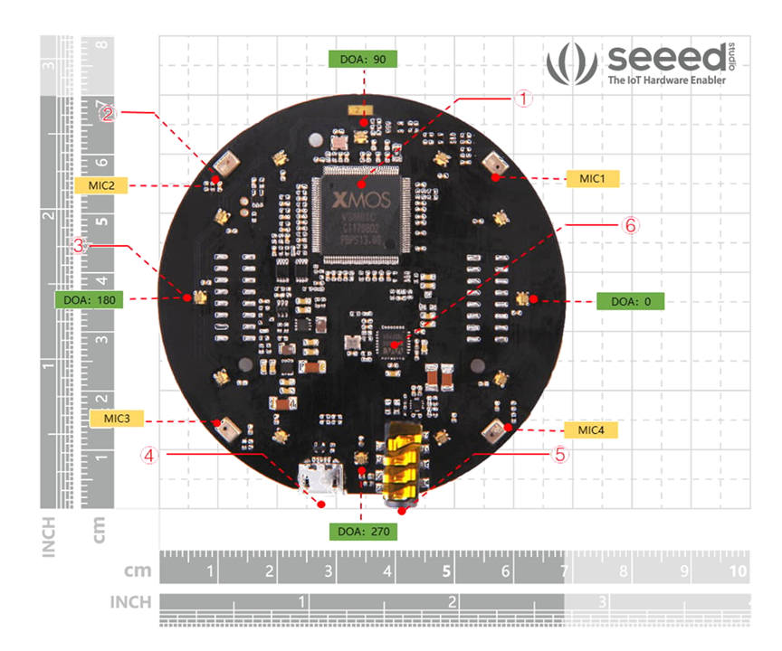
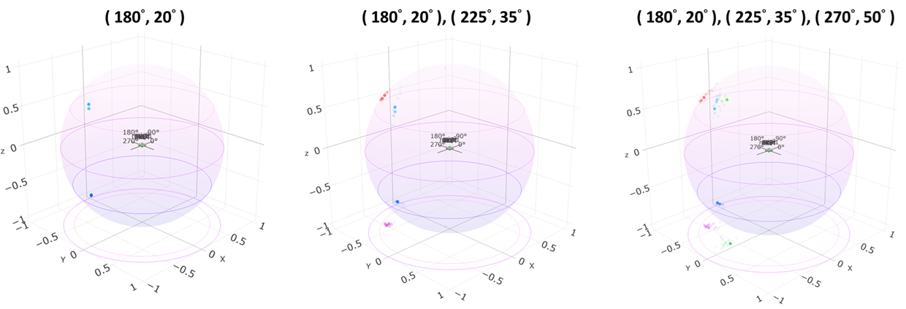
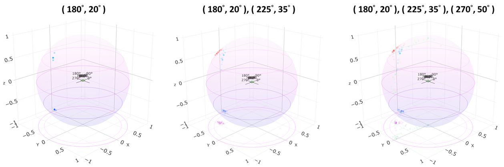

# 3D Multiple Sound Sources Localization (SSL)

### UPDATE: 2025-01-22: Refactor the code to make it more readable, remove redundant functions. Replace the outdated VAD with [Silero-vad](https://github.com/snakers4/silero-vad/tree/master) and fix the typo in the data.

The Steered Response Power Phase Transform (SRP-PHAT) is an important and robust algorithm to localize acoustic sound sources. However, the algorithm can only give us one location estimation. For multi-sources extension, we propose to use the Degraded Unmixing Estimation Technique (DUET) to separate each source and pass it to the SRP-PHAT algorithm to achieve multi-sources tracking.

## Prepare an Environment

```bash
>> git clone https://github.com/BrownsugarZeer/Multi_SSL.git
>> cd Multi_SSL
>> python -m venv venv
>> venv\Scripts\activate.bat
>> pip install -r requirements.txt
```

> [Pyaudio](http://people.csail.mit.edu/hubert/pyaudio/) requires some tricks to install on Windows. If the installation fails, finding [unofficial wheels](https://www.lfd.uci.edu/~gohlke/pythonlibs/#pyaudio) may be a available solution.

## Hardware

The [board](https://github.com/respeaker/usb_4_mic_array) is a far-field microphone array device capable of detecting voices up to 5m away even with the presence of background noise.\


## Running an Experiment

1. Using a microphone stream (online)

```bash
(venv) > python srp_phat_online.py -s=1
Find 1 available sources.
azi:   96.2, ele:   51.8
===================================================
Find 1 available sources.
azi:  129.8, ele:   51.2
===================================================
Find 1 available sources.
azi:   54.0, ele:   30.5
===================================================
...
```

2. Using an audio file (offline)

```bash
# Automatically determine the number of sources
(venv) > python srp_phat_offline.py -s=1 -c=4 -i=None --wave=data/a180e20/50cm/a180e19_3_1b6ede00.wav
Find 1 available sources.
azi:  179.7, ele:   22.7

(venv) > python srp_phat_offline.py -s=3 -c=4 -i=None --wave=data/a180e20_a225e35_a270e50/250cm/a180e19_a224e34_a269e49_3_1c186780.wav
Find 3 available sources.
azi:  223.2, ele:   44.9
azi:  266.2, ele:   51.2
azi:  184.7, ele:   22.0
```

## Tests

### DUET

You can test the DUET algorithm by running the script in `tests` folder. Here is the results of the test.


## Visualization

To easily show what's going on, we use [plotly](https://github.com/plotly/plotly.py) to plot the DOA on a sphere which diameter is 1 meter. The center of the sphere is the microphone array we place at p(x=0, y=0, z=0), the dark blue dots are the Directions of Arrival (DOA), and the lighter dots are the projections on each plane.

```bash
(venv) > python srp_visualizer.py -s=1 --wav=data/a180e20/50cm.csv
```

50cm


150cm



250cm



## Issue

1. The algorithm has a high computational complexity thus making the algorithm unsuitable for real time applications. For estimating one source we need at least 0.3 seconds, estimating N sources we need at least (0.3\*N) seconds,

## References

1. S. Rickard, "[The DUET blind source separation algorithm.](https://www.researchgate.net/publication/227143748_The_DUET_blind_source_separation_algorithm)" Blind Speech Separation, pp. 217-241, 2007.

2. Dey, Ajoy Kumar, and Susmita Saha. "[Acoustic Beamforming: Design and Development of Steered Response Power With Phase Transformation (SRP-PHAT).](https://www.diva-portal.org/smash/record.jsf?pid=diva2%3A830527&dswid=-9722)" (2011).

3. Ravanelli, Mirco, et al. "[SpeechBrain: A General-Purpose Speech Toolkit.](https://speechbrain.github.io/)" arXiv preprint arXiv:2106.04624 (2021).
